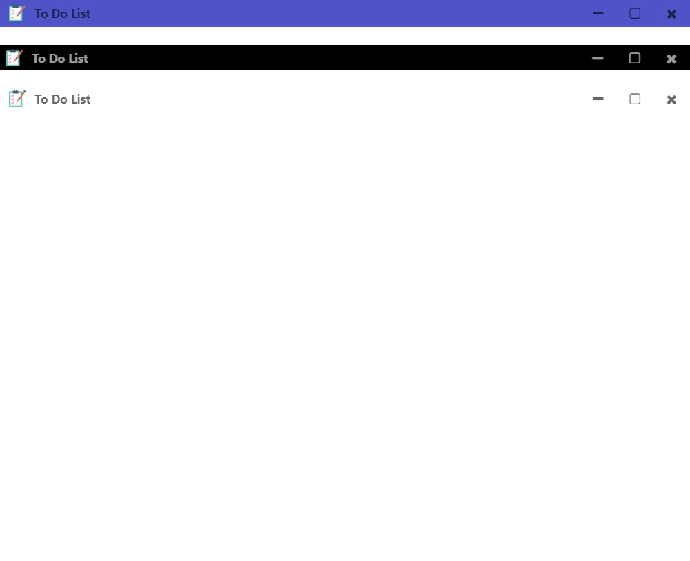

<br />
<div align="center">
  <a href="https://github.com/ehabAbdelMawla/custom-react-electron-titlebar">
   
  </a>
  <h2 align="center">Custom React Electron Titlebar</h2>
  <p align="center">
   React Package Add Custom Title Bar To Electrons Apps 
  </p>
</div>

<!-- TABLE OF CONTENTS -->
<details>
  <summary>Table of Contents</summary>
  <ul>
    <li>
      <a href="#about-the-project">About The Project</a>
    </li>
    <li><a href="#built-with">Built With</a></li>
        <li><a href="#installation">Installation</a></li>
    <li><a href="#usage">Usage</a></li>
    <li><a href="#contact">Contact</a></li>
  </ul>
</details>


<!-- ABOUT THE PROJECT -->
## About The Project
<p align="center">
 
 
  <p>Package Provide A Title Bar Component To View On Electron Apps</p>


## Built With
 <kbd> </kbd> ReactJs <br/>

## Getting Started 
  
### Installation

```sh
npm install custom-react-electron-titlebar --save
```

# Usage

```js
import TitleBar from "custom-react-electron-titlebar"
..
..
..
render(){
  let options = {
            backgroundColor: "#000",
            iconsColor: "#FFF",
            title: "To Do List",
            titleColor: "#FFF",
            icon: true,
            closeIconClass: "fa fa-times",
            maximizeIconClass: "fa fa-square-o",
            minimizeIconClass: "fa fa-minus"
        }
return(<TitleBar options = { options }/>)}
```

# Props
| Prop Name  | Description | Type |
| ------------- | ------------- |------------- |
| backgroundColor  | background of titlebar | String |
| iconsColor | Color Of FontAwesome Icons | String |
| title  | Title Of Project | String |
| titleColor  | Color Of Project Title  | String |
| icon  | true Or false (get icon href from index.html)  | Boolean |
| closeIconClass  | fontAwesome class of close icon | String |
| maximizeIconClass  | fontAwesome class of maximize icon  | String |
| minimizeIconClass  | fontAwesome class of minimize icon  | String |


<!-- CONTACT -->
## Contact
<p align="center">
<a  href="mailto:eabdo1474@gmail.com">
  
</a>
<a href="https://www.youtube.com/channel/UCnoe7bD7w2fWYlNzqY3qjLA">

</a>
<a href="https://www.linkedin.com/in/ehab-abdel-mawla-9b20aa183">

</a>
<a href="https://codepen.io/ehabAbdelMola"> </a>
<a href="https://www.instagram.com/abdoehab4551/"> </a>

</p>
